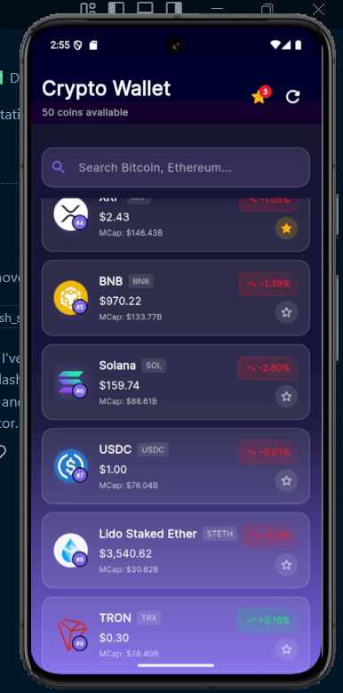
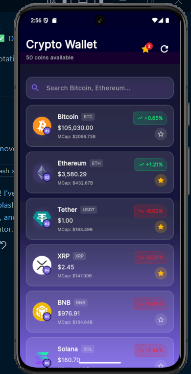
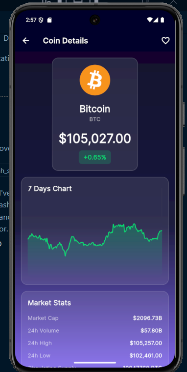
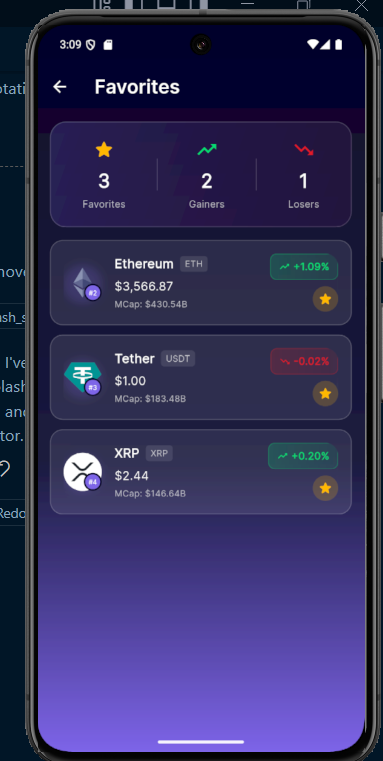
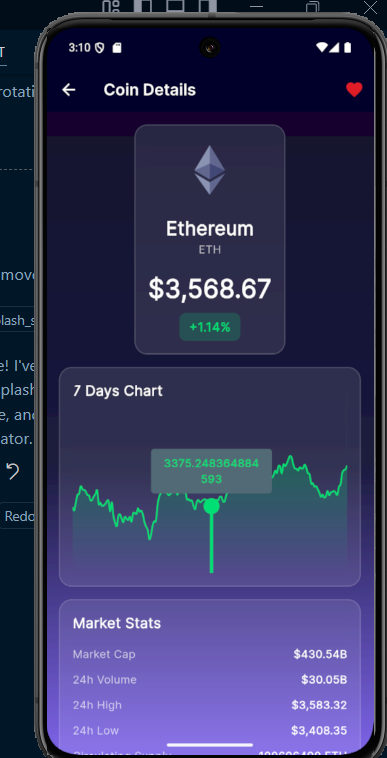

# 🚀 Crypto Wallet - Modern Web3 Dashboard

A beautiful, feature-rich cryptocurrency tracking application built with Flutter. Track real-time crypto prices, view detailed coin information, manage favorites, and stay updated with market trends - all with a stunning modern Web3 UI design.


## ✨ Features

### Core Features

- 📊 **Real-time Crypto Prices** - Live price updates from CoinGecko API
- 🔍 **Smart Search** - Instant search through 50+ cryptocurrencies
- ⭐ **Favorites System** - Save and track your favorite coins (persistent storage with Hive)
- 📈 **Interactive Charts** - 7-day price trend visualization using FL Chart
- 💎 **Coin Details** - Comprehensive information including:
  - Current price & 24h price change
  - Market cap & 24h trading volume
  - All-time high (ATH) & All-time low (ATL)
  - Circulating & total supply
  - High & Low prices (24h)

### Network Resilience 🛡️

- ✅ **Automatic Retry** - 3 retries with exponential backoff (1s, 2s, 3s)
- ✅ **In-Memory Caching** - 5-minute cache with stale fallback
- ✅ **Connectivity Monitoring** - Real-time network status detection
- ✅ **Offline Indicator** - Visual banner when disconnected
- ✅ **Loading Shimmer** - Smooth loading states
- ✅ **Error Handling** - User-friendly error messages with retry options

### UI/UX Design 🎨

- 🌌 **Modern Web3 Design** - Glassmorphism effects & gradient backgrounds
- 🌈 **Beautiful Color Scheme** - Purple/pink gradient with glass cards
- 📱 **Responsive Layout** - Works on all screen sizes
- ⚡ **Smooth Animations** - Shimmer loading & transitions
- 🖼️ **Image Caching** - Fast image loading with persistent cache

## 📱 Screenshots

[






]

## 🎥 Demo Video

[https://drive.google.com/file/d/1dM4WpKsC9o7IubkRXTEl2WCkK-VMPvO3/view?usp=drivesdk]

## 🏗️ Architecture

### Clean Architecture with MVVM Pattern

```
lib/
├── core/
│   ├── constants/       # API constants & configuration
│   ├── theme/          # App theme & colors
│   ├── utils/          # Formatters & helpers
│   ├── widgets/        # Reusable UI components
│   └── network/        # Dio client with retry logic
├── models/             # Freezed data models
├── services/           # API & local storage services
├── viewmodels/         # Riverpod state management
├── views/
│   ├── screens/        # Main app screens
│   └── widgets/        # Feature-specific widgets
├── router/             # GoRouter navigation
└── main.dart
```

## 🚀 Getting Started

### Prerequisites

- Flutter SDK 3.9.2 or higher
- Dart SDK 3.9.2 or higher
- An IDE (VS Code, Android Studio, or IntelliJ)

### Installation

1. **Clone the repository**

```bash
git clone https://github.com/Redoxm/crypto_wallet.git
cd crypto_wallet
```

2. **Install dependencies**

```bash
flutter pub get
```

3. **Generate code**

```bash
dart run build_runner build --delete-conflicting-outputs
```

4. **Run the app**

```bash
flutter run
```

### Build for Production

**Android**

```bash
flutter build apk --release
# or
flutter build appbundle --release
```

**iOS**

```bash
flutter build ios --release
```

**Web**

```bash
flutter build web --release
```

## 🔧 Configuration

### API Setup

The app uses the [CoinGecko API](https://www.coingecko.com/en/api) (free tier).

## 📂 Project Structure

### Models

- `CoinModel` - List view coin data
- `CoinDetailModel` - Detailed coin information
- `MarketChartModel` - Price chart data

All models use `freezed` for immutability and `json_serializable` for API parsing.

### ViewModels

- `CoinListViewModel` - Manages coin list & search
- `CoinDetailViewModel` - Handles coin details
- `MarketChartViewModel` - Chart data management
- `FavoritesViewModel` - Favorites persistence

### Services

- `ApiService` - HTTP requests with caching
- `LocalStorageService` - Hive database operations
- `ConnectivityService` - Network monitoring
- `DioClient` - Configured HTTP client with retry interceptor

## 🎨 Design Decisions

### Why This Tech Stack?

1. **Riverpod** - Better performance than Provider, compile-time safety
2. **Freezed** - Eliminates boilerplate, ensures immutability
3. **Dio** - Powerful interceptors for retry & logging
4. **Hive** - Fast NoSQL database, perfect for favorites
5. **FL Chart** - Beautiful, customizable charts
6. **GoRouter** - Declarative routing with deep linking support

### Resilience Strategy

1. **Retry Logic** - Exponential backoff prevents server overload
2. **Caching** - Reduces API calls & provides offline support
3. **Connectivity Check** - Prevents unnecessary requests
4. **Stale-While-Revalidate** - Shows cached data while fetching fresh data

## 🧪 Testing

Run tests:

```bash
flutter test
```

Run with coverage:

```bash
flutter test --coverage
```

## 📝 Known Limitations

1. **API Rate Limiting** - CoinGecko free tier: 10-30 calls/minute
2. **Cache Duration** - 5 minutes (trade-off between freshness & API limits)
3. **Coin Limit** - Displays top 50 coins by market cap
4. **Chart Range** - 7-day price history only

## 🔮 Future Enhancements

- [ ] Price alerts & notifications
- [ ] Portfolio tracking with holdings
- [ ] Multiple currencies support
- [ ] Dark/light theme toggle
- [ ] News feed integration
- [ ] Watchlist widget for home screen
- [ ] Detailed analytics & insights
- [ ] Social features (share, compare)

## 🤝 Contributing

Contributions are welcome! Please feel free to submit a Pull Request.

1. Fork the project
2. Create your feature branch (`git checkout -b feature/AmazingFeature`)
3. Commit your changes (`git commit -m 'Add some AmazingFeature'`)
4. Push to the branch (`git push origin feature/AmazingFeature`)
5. Open a Pull Request

## 👏 Acknowledgments

- [CoinGecko API](https://www.coingecko.com/en/api) for crypto data
- [Dribbble](https://dribbble.com) & [Behance](https://www.behance.net) for design inspiration
- Flutter community for amazing packages
- HNG13

## 📧 Contact

Luqman Adebayo - [@Adebayoluqman](https://twitter.com/Adebayo)

Project Link: [https://github.com/Redoxm/crypto_wallet.git](https://github.com/Redoxm/crypto_wallet)

---

Made with ❤️ and Flutter
